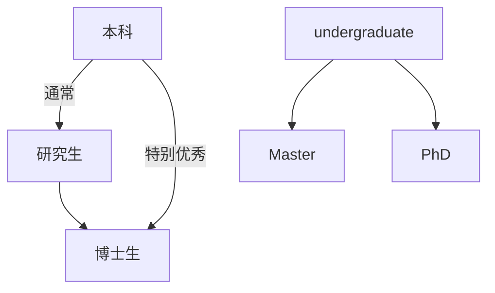

# 总体上讲

一、4个最为优秀的computer science Program是麻省理工大学MIT，斯坦福大学Stanford，加州伯克莱分校UC．Berkeley和**卡内基梅隆CMU**。这四家基本没什么争议，得到大家的广泛认可。
二、6个其他前十的computer science：UIUC，康乃尔大学Cornell，**华盛顿大学U. of Washington**，普林斯顿大学Princeton，德州奥斯汀分校U. of Texas-Austin和威斯康星大学U. of Wisconsin-Madison，其中UIUC，Cornell，U．of Washington和UW－Madison几乎从未出过前十名。
三、其他非常非常优秀的computer science：玛里兰大学U. of Maryland，加州拉斯韦加斯分校UCLA，布朗大学Brown，哈佛大学Harvard，耶鲁大学Yale，普渡大学Purdue，，密歇根大学U. of Michigan和滑铁卢Waterloo(加拿大)等等．

# 卡内基梅隆大学CMU

**卡内基·梅隆大学**（英语：Carnegie Mellon University，缩写为CMU）是一所位于美国[宾夕法尼亚州](https://zh.wikipedia.org/wiki/賓夕法尼亞州)[匹兹堡](https://zh.wikipedia.org/wiki/匹茲堡)的[研究型](https://zh.wikipedia.org/wiki/研究型大學)[私立大学](https://zh.wikipedia.org/wiki/私立大學)。

# 华盛顿大学 UW

华盛顿大学（University of Washington），简称UWashington 或UW。位于西海岸北部华盛顿州西雅图市，**西雅图有很多科技公司**。但是，**WU似乎不招CS专业MS硕士留学生**，只招收PhD。（MS: Master of Science，理学硕士）

此外，还有一些学校。这些学校的申请主页上一般都明确地说明他们是研究机构，对于培养Master没有兴趣，**招的Master很少**，所以基本上没有master录取者（约等于不招收硕士）。例如学校

# 圣路易斯华盛顿大学 WUSTL

关于安全问题：圣撸的治安一直是所有入读的同学去之前很关注的问题，抛出地理位置暂时不提（地理位置确实不好，如果你是CS方向的找工作来的大厂不多，EE和ME到时波音每年都来捞人），治安被误会的是“东圣”地区，但是圣撸所在的university city是很靠很靠北面，平均治安情况远高于美国平均水平，并且PHD的学生基本上你要每周1-4很老板在一起混，或者pizza活动，也根本没有像本科和master那么多学生大半夜party的时间

# 哥伦比亚大学

<<<<<<< Updated upstream
=======

# 卡内基梅隆大学CMU

**卡内基·梅隆大学**（英语：Carnegie Mellon University，缩写为CMU）是一所位于美国[宾夕法尼亚州](https://zh.wikipedia.org/wiki/賓夕法尼亞州)[匹兹堡](https://zh.wikipedia.org/wiki/匹茲堡)的[研究型](https://zh.wikipedia.org/wiki/研究型大學)[私立大学](https://zh.wikipedia.org/wiki/私立大學)。

>>>>>>> Stashed changes

# 南加州大学USC

**南加州大学**（英语：University of Southern California，缩写：**USC**或**SC**），简称**南加大**，也译作**南加利福尼亚大学**，位于美国[加州](https://zh.wikipedia.org/wiki/加州)(State of California)[洛杉矶](https://zh.wikipedia.org/wiki/洛杉磯)市中心.

[【文章】被南加州大学（USC）计算硕士项目录取是怎样的体验？ - 知乎 (zhihu.com)](https://www.zhihu.com/question/266990773/answer/1610612694)

据说**南加州大学是中国留学生留学时比较愿意选择的学校**

# UCLA

# 杜克大学

杜克大学官方网站：[Applying for CS | Duke Computer Science](https://www.cs.duke.edu/graduate/apply)

# 加州理工学院 Caltech

加州理工学院(California Institute of Technology)，简称Caltech，学院和大学的区别下文有介绍。

# 治安

## [美国十大最危险的城市](https://liuxue.hujiang.com/abroad/life/p380446/)

### 西雅图的治安

西雅图的治安整体情况还是比较好的，细分下来，个人觉得居住体验是贝尔维尤地区>华大大学城及其以北>西雅图市中心。如果你的预算足够并且有合适的交通工具(有车最好，但公交也很方便)的话，贝尔维尤的居住体验肯定是最好的，极少听说有犯罪案件的发生。但如果你是在西雅图上班或者上学，个人还是比较推荐住在西雅图靠北的地区。虽然西雅图近两年来出现人身安全事故的数量相比往年有所增长，但即使如此，也比其他美国大城市的犯罪率低很多了。

话说回来，西雅图的大学城和市中心附近聚集的流浪汉数量近年来也在不断上升，这是因为西雅图市相对弱势的流浪汉安置政策；再加上大学城附近新建了一所food bank，所以时常会有流浪汉聚集在周围等待领取补助的食物。但其实只要你不是热衷于窜走于无人的小巷或者习惯半夜一个人出门，基本遇到危险的几率还是很小的。华大附近的大多数流浪汉都不具有攻击性，最多就是问你要几块零钱，或者有没有食物或者烟可以分给他们。最最最不济的情况，可能会出现有精神不太正常的流浪汉远远的跟着你或者想要和你搭讪。

# 资金证明

# 补充

### 硕士/学历/学位/MS/ME...一系列概念

汉语上讲，学历有本科学历和研究生学历，其中**研究生**包括硕士研究生(Master)和博士研究生(Phd)。

**硕士研究生**，即攻读**硕士学位**的研究生，简称硕士生，人们日常生活中所说的考上了硕士，读硕士等，正是指硕士研究生。

**博士研究生**：即攻读**博士学位**的研究生，简称博士生，是研究生学位中最高的一级。 人们日常生活中所说的考上了博士，读博士等，正是指博士研究生。 正在读的还没有获得博士学位的学生，严格来讲只能称为博士研究生；已经获得博士学位的人员，才是真正意义上的博士。

PS：**博士后既不是学历也不是学位，**他是博士毕业后的不直接就业，然后继续在相应的学术机构，也就是博士后流动站继续开展后续研究或深造的一种半就业形态。通俗地讲就是博士毕业后的阶段。

所以说，硕士生和博士生都是研究生，学历是相同的，但是学位不同，学位上讲博士生比硕士生高级。

他们对应的英语说法如下：

首先，本科生为 Undergraduate，研究生为 Postgraduate。

学位为 degree，有三种学位分别为 本科学位 Bachelor Degree (也可以灵活一些用 undergraduate degree) 、硕士学位 Master's degree 、博士学位 PhD

---

国内一般是先读硕士，读完硕士读博士，也有直博生（本科毕业直接博士）。申请美国高校，与国内不同，不需要先完成master的学位，也可以直接申请PhD。

硕士基本上还是在教室上课的那种，不需要找导师；而博士需要有导师，并且主要做科研。**我个人考虑留学做硕士研究生**，不考虑读博士，大概原因如下：

1. 博士主要是做科研的，虽然说博士比硕士高级，但是做科研过程枯燥且无聊，如果没有科研结果可能还会无法毕业。（**我个人来讲，确实对科研这件事情没有太大兴趣**）
2. 我认为我需要一段时间去适应英语授课的环境，因此直接去做科研我认为不合适。
3. 一般在美国读计算机博士需要4-5年毕业，但硕士为2年，硕士时间很短。
4. （如果我在读硕士过程中发现做科研有趣，我也可以选择读完硕士再读博士。）

---

MS：Master of Science，理学硕士。**以应用、就业为导向**。学生可以早一点找工作，因为门槛低，找到好工作的机会在美国来说，比较容易；但也意味着很可能没有奖学金。

MS: Master of Science，理学硕士

ME: Master of Engineering，工程学硕士

理学硕士学位是偏向于升学导向，衔接PHD的深造，课程内容更学术，一般也都有做论文的option。而工程学硕士学位是偏向于就业导向的，课程内容更实践性，毕业一般也不做论文，只修课。

### 一些美国著名的公司

### 大学和学院的区别

1、学校规模不同：大学在校生人数要在8000以上，研究生人数至少占5%。学院在校生不少于5000人即可。

2、学科门类不同：大学要有3个以上门类，每个主要门类应设立3个以上一级学科。大学本科专业数量应大于20个，且有2个以上硕士学位授予点。学院有一个以上门类即可，并且主要学科门类下设专业超过3个。

3、基础建设不同：大学和学院的土地面积、建筑面积、馆藏图书、仪器设备、实习实训场所等都有一些差异。

### 一些专业简写

EE：电子工程 Electrical Engineering

**CS**：计算机科学 computer science 计算机科学是系统性研究信息与计算的理论基础，以及这些理论如何在系统中实现与应用的学科。在计算机领域中相对于其他方向，**CS更注重逻辑，它主要研究编程语言，算法运行等。**在美国，不同学校会对CS专业细分成不同方向。

CE：计算机工程 computer engineer 计算机工程专业处于电机工程学和计算机科学的交叉领域中。**与CS相比，CE的应用性更强，且更注重硬件方面的内容。**除了基本的编程技巧，CE专业还需要熟悉电子工程方面的知识。**CE专业的课程设置相较于CS来说比较单一**，不同学校对该专业的课程设置差别不大。

BA：美国大学ba是指商业分析专业，其英文全称为Business Analytics。商业分析专业主要是通过运营分析以及统计的专业知识，形成预测模型，从而促进企业与客户之间、企业与合作者之间、或者企业内部员工之间的有效沟通以及技术优化。其核心是利用数据分析与现在的互联网及大数据相联，通过高深的技术、模型和算法对企业进行数据挖掘和商业分析，通过结果来对未来的商业战略进行预测和指导。