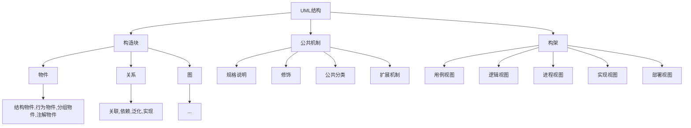

---

graph TD;layout: article
title: UML笔记
key: 20220406
tags: 计算机
pageview: false
modify_date: 2022-04-06
aside:
  toc: true
---

软件学院大二下UML课程笔记

<!--more-->

UML的结构包括**构造块building blocks、公共机制和构架**三个部分。

*UML有三种基本的构造块，分别是事物（thing）、关系（relationship）和图（diagram）。事物是UML的重要组成部分，关系把事物紧密联系在一起，图是多个相互关联的事物的集合。规则是构造块如何放在一起的规定，包括为构造块命名；给一个名字以特定含义的语境，即范围；怎样使用或看见名字，即可见性；事物如何正确、一致地相互联系，即完整性；运行或模拟动态模型的含义是什么，即执行。*

## 2.1 UML结构

**公共机制**是指达到特定目标的公共UML方法，主要包括规格说明（详细说明）、修饰、公共分类（通用划分）和扩展机制4种。
**公共机制**指人们在使用UML时共同遵守的四种机制，使得使用UML变得比较简单。这四种公共机制是Specification(规格说明)、Adornment（修饰）、Common Divisions(公共划分)和Extensibility Mechanisms（扩展机制）。

规格说明是事物语义的细节描述，它是模型真正的核心。

【类图中的关系】

类图是系统的一种静态视图，用**聚合关系**可明确表示两类事物之间存在的**整体/部分形式的关联关系**。（**组合关系是特殊的聚合关系，这两者都是特殊的关联association关系**）。UML类图中,若类A中包含了其他类的实例,且当类A的实例消失时,其包含的其它类的实例也消失,则类A和它所包含的类之间存在**组合关系**。

已知类A和类B之间存在关联关系，类A可见类B，且**多重性**定义为1。则表示在编写代码时，类A存在一个属性，该属性的类型是类B。

聚合aggregation

组合composition

依赖dependency

泛化generalization

【用例Use Case视图】显示外部参与者观察到的系统功能

【用例use case】是一种有效捕获系统功能性需求的方法，它从参与者（Actor）角度刻画了参与者期望系统为其提供的功能或服务。

**用例的规格说明specification**：是对用例的详细说明，其中包含的内容包括：用例的主要参与者、次要参与者（如果有的话）；前置条件，即用例开始启动时系统需要满足的条件；**事件流**，这是用例规格说明中最重要的部分，其中包含了用例执行过程中参与者和系统之间交互的动作步骤；后置条件，即用例执行完成系统必须满足的条件。

【场景scenario】描述了用户与系统的一次特定的交互过程，相当于用例的实例，即用例是对同一功能的各种可能场景的抽象和概括

【参与者Actor】是系统范围之外的，与系统进行交互的元素。参与者对应的是一种角色，而不是具体的对象；同一对象可以在系统中作为不同的参与者存在。参与者可以是人、系统、软硬件设备，甚至是时间等能启动系统功能或是系统与之交互的任何元素。

==用例与参与者之间的关系是**关联**==

## 2.7 用例图User Case

刻画功能性的需求。

用例图举例：

## 2.8 类图 Class Diagrams

类图  =  类 +  关系 +  约束

类图：是软件的蓝图，详细描述了系统内各个对象的类型，以及这些类之间的**静态关系**

类（类中包含类的属性和操作）

关系（关联，聚合，组合，泛化，依赖）

约束（**多重性，一对一还是一对多**；注释）

【类图的举例】

在类图中，首先能看到各种类的构成和结构。每一个订单会关联到一个买家，一个买家可以定多个订单，也可以一个都不下，所以

订单和订单项目是聚合关系，意思为订单项OrderItem构成了订单。如果取消了订单Order，OrderItem也消失，所以也可以进一步改成组合关系

（==老师这里讲的多重性——关系上面的数字是双向讲的，比如A1---0-nB，要解释成一个A可以关联多个即0-n个B，但一个B只对应一个A。我认为这里完全可以将关系简化成一对一和一对多两种，这样就可以很方便的解释数字。当然多对多这种情况我暂时没有看到。==）

【基本元语】

### 2.8.3 类图的三个抽象层次

概念层、逻辑层、实现层：逐步深入，由浅入深，在绘制的过程中得到的信息越来越全面，因此得到的类图也越来越详细、具体。

**概念层**（只需要用类的名字呈现出**重要业务对象**和业务领域中抽取的业务对象之间的关系）

**逻辑层**（对概念层的深化，进一步展开类图中类的内容，但更详细的细节不需要考虑）

**实现层**（展开类的所有内容，包括属性名，类型，可见性，初始值等。实现层中的类应该能够立即用于编程实现）

【三个层次举例】一个图书管理系统的类图：

|  |  |  |
| ------------------------------------------------------------ | ------------------------------------------------------------ | ------------------------------------------------------------ |
| 概念层                                                       | 逻辑层                                                       | 实现层                                                       |

### 2.8.4 类图的构建步骤

简单类图的创建步骤，如果更复杂的类图创建（实体类，边界类，控制类），需要==第四部分面向对象分析创建类图==

建立简单类图的一般步骤：

1. 从需求文字描述中抽取类（实体类），明确类的属性和操作
   （名词筛选法：在需求描述中找名词，选择合适的n.作为类）
2. 定类之间的关系。关联，泛化，聚合，组合，依赖
3. 调整

## 2.9 对象图 Object Diagram

对象图用于类图的进一步补充，**对象图是在系统运行过程中，给系统瞬间拍一个快照。**

使用场合：用类图刻画后，对类图理解困难时，可以使用对象图对类图进行进一步的理解。

对象图 = 对象 + 链

【对象的表示方法】

* object name
* object name: Class Name
* :Class Name（一个匿名对象）

链是对象与对象之间的实现，表示对象之间的通讯

【对象图的举例】

【对象图和类图的对比】

## 2.9’ 包图

包是一个分组物件。可以把包比作一个存放模型元素的箱子或容器。

【包图的举例】

## 2.10 顺序图和通信图（交互图）

（所以说顺序图和通信图就是画出一个用例——一个功能（一个方法）的具体实现过程）

**刻画一个用例中若干个对象交互的过程（区分交互图与状态图）**

用例的正常事件流、用例的备选事件流

### 顺序图

#### 消息

**一个对象调用另一个对象中的行为时，即完成了一次消息传递**

UML中用**实心箭头的实线表示消息**。箭头表示一个消息，由消息的发送方指向消息的接收方。

【消息的命名】

属性 = 消息名(参数: 参数类型) : 返回值

【消息命名的举例】

③ 简单消息，同步消息和异步消息（了解，不做精准要求）

简单消息只表示控制如何从一个对象发给另一个对象，并不包含控制的细节

同步消息（实心箭头）发送消息后**必须等待对方执行完这件事**，之后才能执行其他事情。有阻塞和等待。

异步消息（开放箭头）发送消息之后**不必等待**对方执行完这件事，就可以去执行其他事情

【对象创建消息和对象撤销消息】两种特殊的消息

【无触发对象和无接收对象的消息】

不关注是谁给他发的消息，即创建节点form node

无接收对象的消息，不关注接收消息的人是谁

【自我调用消息】自己指向自己的消息

【控制消息】语法为：[表达式]消息标签，`*[]`表示循环

【消息的返回值】用虚线的单线箭头表示，语法为：返回变量 = 消息(参数)

**【顺序图的举例】**

看一下这幅图描述的场景：上面的四个蓝色方框表示**顺序图的参与对象**，分别是——订单对象，订单项，产品对象，顾客对象。

（蓝色的长方条叫**活动条**）

问题： 这幅图有什么问题？有什么可以完善的地方？

面向对象，希望当变动发生时，变动的影响范围尽可能小，不至于发生比较大的波动。**推荐把相关的数据和对数据进行的操作放到一起**。这个图计算价格的**行为**在Order里面，相关数据在其他的对象中，这样的设计不好。

改进后的顺序图：

（返回消息不是必须在图中画出来，不是必须用虚线画回去）

### 通信图 (Communication Diagram) 

通信图原来叫做协作图。和顺序图相比，通信图与顺序图完全等价。顺序图比通信图应用更加广泛。

两者完全等价，但是突出的重点不一样。顺序图更关注对象之间交互的先后**顺序**，通信图呈现出对象之间交互的结构和对应关系（消息的先后次序必须用编号表示）。

通信图 = 交互的参与者 + 通信链 + 消息（结果和顺序图十分类似）

**【通信图举例】**

【总结】

==那么这个顺序图也好通信图也好他都是刻画了对象之间的交互的一个过程他们之间的交互都是通过消息发送消息记录消息来产生的对象之间的交互所以这个他们属于一种动态图形他们刻画的是系统的动态行为==

## 2.11 状态图和活动图

### 状态机图（状态图）

状态机图（状态图）

【掌握目标】状态基础他刻画的这个内容是什么他是对什么样的一些信息进行刻画那么再有就是这种图形他的基本的图形符号然后具有的含义以及我们在绘制的时候的一些绘制方法啊

当要刻画的系统当中有一些对象或者一些元素，有非常明显的行为特征的时候，就可以用状态机图为这样的元素的行为进行建模。

特征：**对象的行为由其状态决定**

状态机图刻画的是单一元素（单一元素可能是一个class，也可能是一个子系统）。不为所有元素创建状态机图，只刻画有明显行为特征的元素。

【状态机图的举例】

状态之间的箭头表示状态的转换

**状态是对象在它的生命周期中的一个条件或状况（时间段内维持的状态，不是时间点）**，在此期间对象将满足某些条件、执行某些活动或等待某些事件。

【状态的种类】

简单状态(Simple State) 
复合状态(Composite State) 

为什么要用复合状态？

初始状态(Initial State) 实心圆
终止状态(Final State) 
结合状态(Junction State) 不常用
历史状态(History State) 

【状态内部的活动】

entry，do，exit

【迁移】

转换分为外部转换和内部转换，如图，这属于外部转换（因为是先出去，再进来。想象状态内部有一个exit内部的活动，如果退出一定会执行的）

### 活动图

活动图和程序流程图十分类似，用来描述活动流程的图形

对复杂的用例，为了理解方便，可以绘制活动图。这也很好的呼应了他的构成，就是程序流程图，描述一个算法的流程。

活动图可以对**业务流建模**，**工作流建模**，算法流程建模。

【活动图的举例】

圆角矩形

菱形：条件判定节点  decision  （分支branch）

同步条：并发成为多个分支

## 2.12 组件图和部署图

# 3用例建模 Use-Case Modeling

> 3.1前言（使用UML画图很容易，建模用来解决我们“画什么”这个困难的问题）
> 3.2需求（需求是什么，如何采集需求）
> 3.3基于用例的需求分析过程
> 3.4用例建模示例

## 3.1&3.2 前言&需求

**需求：系统必须满足的条件或具备的能力**

（我的理解：需求就是甲方对我们构建的系统的要求。）

需求本身难捕获且易变，我们对需求本身也容易存在误区，因此需求也需要开发。

需求收集包括五个关键步骤：

1. 找到可以帮助你理解这个系统的人
2. 倾听这些相关人员的描述，并从他们的角度来理解系统
3. 利用一个容易理解的模型来描述用户希望如何使用这个系统以及为他们提供的什么价值
4. 详细地描述系统和客户以及系统和外部系统之间的交互
5. 重构（refactor）这个详细描述以保证它是可读且易懂的

## 3.3 基于用例的需求分析过程

> 1.获取原始需求（略）
> 2.**开发一个可以理解的需求**：实际上就是一个画用例图的过程
> 2.1识别参与者 -> 2.2识别用例 -> 2.3构建用例图
> 3.详细、完整地描述需求：进行用例阐述，写用例规约（用例文档）
> 4.重构用例模型
> 4.1识别用例间的关系
> 4.2对用例进行组织和分包

### 3.3.2 开发一个可理解的需求

**【参与者】**

参与者Actor：参与者是**在系统之外**，透过**系统边界**与系统进行**有意义交互**的任何事物。参与者可以是人、外系统、外部因素、时间等事物。（**要学会识别参与者**）

参与者的**泛化**：

**【用例】**

用例Use-Case：用例实例是**系统执行**的**一系列动作**，这些动作将生成特定**参与者可观测的结果值**（可以简单理解为：用例就是一个功能，一个函数）

**用例的要点：**

1. 用例是**描述交互**的功能，而**不是系统内在的系统活动**。**不能把系统活动当用例**。例如在登录过程中，不能将**建立数据库连接**，**执行SQL语句**作为用例
2. 一个用例对应一个系统的**具体的功能**
3. 用例是业务语言而非技术语言——用例使用的是用户词汇，而不是技术词汇。如：发票，商品，洗衣机，而不是：记录，字段，COM，C++等
4. 用例的结果值**由系统生成**（与系统有关）。用例是需要系统处理的，系统为我们提供的服务。一个用例不能是与系统无关的事情。

用例**粒度**的确定：如果用例粒度定义过细，则会陷入功能分解。过细的粒度，一般都会导致技术语言的描述，而不再是业务语言（每一个用例成为了一个步骤）

【例子】

|  |  |
| ------------------------------------------------------------ | ------------------------------------------------------------ |
| 原用例图                                                     | 修改后的用例图                                               |

错误一：发送邮件和收邮件的用例关系不能在用例图中刻画。用例图中用例的关系只有三种。

错误二：发件人和收件人都是终端的使用者，因此他们既可以发邮件也可以收邮件。

错误三：系统边界之外不能有“系统”作为一个Actor。终端可以定时进行查看是否有新邮件，如果有进行提醒，这是属于系统范围之内的。

因此，修改后的绘制更有效，更完整。

### 3.3.3 详细、完整地描述需求

用例图是骨架，而用例规约则是其内在的肉。用例规约就是全面的介绍一下，包括用例名称、用例标识、涉及的参与者、描述、**用例的规格说明**和其它非功能需求、设计约束、尚存在的问题等。

**用例的规格说明**是对用例的详细说明，其中的内容包括用例的参与者、前置条件 PreConditions、后置条件 PostConditions、正常事件流 Flow of events和备选事件流 Alternate flow。

为了补充，我们可以在用例说明中画一个**活动图**(2.11)，来帮助我们更好的分析用例。一张完整的活动图是所有用例的集成图。

### 3.3.4 用例关系

【**用例之间三种关系：包含，扩展，泛化**】

* 包含include：（**函数和子函数的关系**）在箭头发起点是基本用例，箭头指向的是被包含用例，在执行基本用例的过程中会执行被包含用例（依赖关系的一种）
* 扩展extend：（在某种条件下，可能会执行额外的步骤）箭头发起点是扩展用例，箭头指向是基本用例`注意一下这里的箭头指向和包含关系是相反的`（依赖关系的一种）
* 泛化generalization：派生，表示子用例继承了父用例，子用例指向父用例。一项用例可以有多种执行的方式

> **包含和扩展关系的详细解释：**
>
> 如果用例A包含用例B，则表示用例A本身是不完整的，每次用例A的执行都必须执行用例B中的动作序列，即用例A主动包含用例B，A知道B。
>
> 如果用例B扩展用例A，则表示用例A本身是完整的，可以在不执行用例B中动作序列的情况下完成自身功能，只有当特定条件满足时，用例B中的动作序列才会执行。即用例A不知道B的存在，用例B主动去扩展A。
>
> 包含关系常用于在多个用例中都包含一些相同的动作步骤，而这些动作步骤又可以看作是一个相对独立的用例，这时可以将这些共同的动作步骤定义为一个新的用例，被其他用例所包含。
>
> 扩展关系常用于先定义一个基本功能用例，然后在需要对其增加扩展处理能力时定义新的扩展用例，去扩展原来的基本功能用例。

**用例和参与者Actor之间的关系是关联关系**（通信关联，交互）

【用例关系的举例】

|  |  |  |
| ------------------------------------------------------------ | ------------------------------------------------------------ | ------------------------------------------------------------ |
| 包含关系                                                     | 扩展关系                                                     | 泛化关系                                                     |

