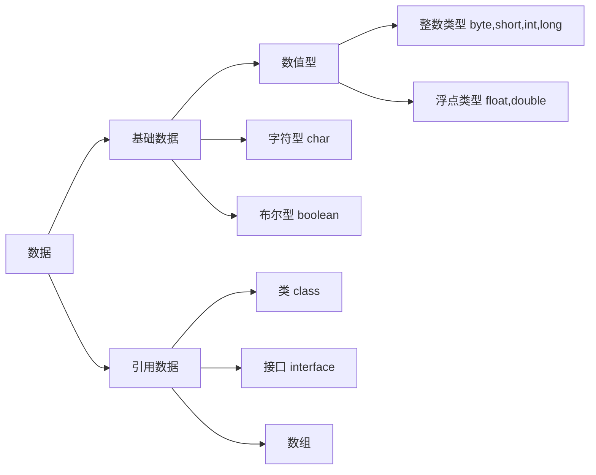

# 笔记记录

<!--参考教材：《Java程序设计》 机械工业出版社，黄岚 王岩 王康平 编著，ISBN: 978-7-111-43153-4 -->

## 1 Java运行机制 

Java 应用程序的开发周期包括编辑、编译、装载、解释和执行几个部分。程序编译时将Java 源程序翻译为 JVM可执行代码——字节码（.class）。这一编译过程同 C/C++ 的编译有些不同。

当C编译器编译生成一个对象的代码时，该代码是为在某一特定硬件乎台运行而产生的。因此，在编译过程中，编译程序通过查表将所有对符号的引用转换为特定的内存偏移量，以保证程序运行。Java编译器却不将对变量和方法的引用编译为数值引用，也不确定程序执行过程中的内存布局，而是将这些符号引用信息保留在字节码中，由解释器在运行过程中创建内存布局，然后再通过查表来确定一个方法所在的地址。这样就有效地保证了 Java 的可移植性和安全性。

运行 JVM 字节码的工作是由解释器（Java命令）来完成的。解释执行过程分为三步：代码的装入、代码的校验和代码的执行。

装入代码的工作由 “类装载器”(class loader)完成。类装载器负责装入运行一个程序需要的所有代码，这也包括程序代码中的类所继承的类和被其调用的类。当类装载器装入一个类时，该类被放在自己的名字空间中。除了通过符号引用自己名字空间以外的类，类之间没有其他办法可以影响其他类。在本台计算机上的所有类都在同一地址空间内，而所有从外部引进的类，都有一个自己独立的名宇空间。这使得本地类通过共享相同的名字空间获得较高的运行效率，同时又保证它们与从外部引进的类不相互影响。

当装入了运行程序需要的所有类后，解释器便可确定整个可执行程序的内存布局。解释器在符号引用与特定的地址空间之间建立对应关系及查询表。通过在这一阶段确定代码的内存布局，Java 很好地解决了由于超类改变而使子类崩溃的问题，同时也防止子代码对地址的非法访问。

随后，被装入的代码由字节码校验器进行检查。校验器可发现操作数栈溢出、非法数据类型转化等多种错误。通过校验后，代码便开始执行了。

Java 字节码的执行有以下两种方式。
1）即时编译方式：解释器先将字节码编译成机器码，然后再执行该机器码。
2）解释执行方式：解释器通过每次解释并执行一小段代码来完成 Java 字节码程序的所有操作。

通常采用第二种方式。由于 Java 虚拟机规格描述具有足够的灵活性，这使得将字节码翻译为机器代码的工作具有较高的效率。对于那些对运行速度要求较高的应用程序，解释器可将 Java 字节码即时编译为机器码，从而很好地保证了 Java 代码的可移植性和高性能。

Java 虚拟机是软件模拟的计算机，可以在任何处理器上（无论是在计算机中还是在其他电子设备中）安全并且兼容地执行保存在.class 文件中的字节码。Java 虚拟机的“机器码”保存在.class 文件中，有时也可以称为字节码文件。Java 程序的跨平台主要是指字节码文件可以在任何具有 Java 虚拟机的计算机或者电子设备上运行，Java 虚拟机中的 Java 解释器负责将宇节码文件解释成为特定的机器码运行。Java 源程序需要通过编译器编详成为.class文件（宇节码文件）。


## 1’ Java代码安全性

> 例题：
>
> 【多选】下面有关JAVA代码安全性的叙述正确的是：
> A. 字节码校验器加载查询执行所需的所有类
> **B**. 运行时由解释器执行代码
> **C**. 运行时，字节码被加载，验证，然后在解释器中执行
> **D**. 类加载器通过分离本机文件系统的类和从网络导入的类增加安全性


字节码校验器：

当**类加载器**将新加载的.class字节码传递到虚拟机时，这些字节码首先要接受校验器的校验。校验器负责检查那些无法执行的明显有破坏性的操作。**除了系统类（System类）之外，其他类都要被校验。**

* 【[java安全--字节码校验_githubshareing的博客](https://blog.csdn.net/qq_18377515/article/details/79590773?utm_source=app&app_version=5.5.0)】


Java程序运行的过程是这样的：

* 类加载器(class loader)加载程序运行所需要的所有类，它通过区分本机文件系统的类和网络系统导入的类增加安全性，这可以限制任何的特洛伊木马程序。因为本机类总是先被加载，一旦所有的类被加载完，执行文件的内存划分就固定了，在这个时候特定的内存地址被分配给对应的符号引用，查找表(lookup table)也被建立。
* 由于内存划分发生在运行时，解释器在受限制的代码区增加保护防止未授权的访问，然后字节码校验器(byte code verifier)进行校验，主要执行下面的检查：类符合JVM规范的类文件格式，没有违反访问限制，代码没有造成堆栈的上溢或者下溢，所有操作代码的参数类型都是正确的，解释器在必要时通过运行时系统执行对底层硬件的合适调用。


## 2 Java标识符要求

标识符是类、方法、变量的名字。Java 标识符由数字、字母、下划线（_）和美元符号（＄）组成，并且要求首位不能是数宇。在Java中标识符是区分大小写的，而且Java 关键宇不能用作Java标识符。非法的标识符是无法通过编译的。

Java 对标识符的说明如下：

1. Java 语言采用 Unicode 宇符集来表示标识符。
2. Unicode 宇符采用 16bits 存储格式，可以是包括中文在内的多国文字。
3. Java 标识符中的字母是大小写敏感的
4. **<font color = #007FC8>Java 语言的标识符是以字母、下划线（_）或＄符号开头，后面含字母、下划线、＄符号和数字的宇符串。</font>**

```JAVA
//举例：
$mouse      ✅ //满足要求
_try123     ✅ //满足要求，但不规范
1cat        ❌ //以数字开头
cat-1       ❌ //含有非法字符
cat/dog     ❌ //含有非法字符

```


## 3 Java数据类型




* Java的布尔类型的true和false首字母是**小写**的。
* 注意byte为8位整形，取值范围-128~127


## 3‘ Java数字后面的修饰符

默认情况下5被视为整数，而3.0是双精度，有时需要添加修饰符。

D表示double类型，F表示float类型，L表示long类型

==符号不分大小写==

> 例题：关于数据类型的声明，以下声明正确的是：
> Q：`byte a = 129`
> A：错误，因为byte的范围是-128~127
>
> Q：`long b = 129F`
> A：错误，**<font color = #007FC8>Java不允许使用不相同的类型进行赋值，必须加上强制类型转换，否则编译是不通过的。</font>**
>
> Q：`float num = 4.0`
> A：错误，必须强制转换或者加上f


## 4 赋值操作符：基本类型or引用类型

基本类型赋的值在栈里，引用类型的值在堆中。

引用类型的赋值，相当于让引用指向”另一个对象“。


## 5 位运算操作符 P31

| 操作符 | 实际操作   |           | 例子                         |
| ------ | ---------- | --------- | ---------------------------- |
| `~`    | 按位取反   | `~a`      | 对a按二进制每位取反          |
| `&`    | 与运算     | `a & b`   | 对a和b按二进制位进行与运算   |
| `|`    | 或运算     | `a | b`   | 对a和b按二进制位进行或运算   |
| `^`    | 异或运算   | `a ^ b`   | 对a和b按二进制位进行异或运算 |
| `<<`   | 左移       | `a << b`  | 对a左移b位，低位用0填充      |
| `>>`   | 有符号右移 | `a >> b`  | 对a右移b位，高位用符号位填充 |
| `>>>`  | 无符号右移 | `a >>> b` | 对a右移b位，高位用0填充      |


## 6 三元运算符 细节

```java
char x='X';
int i = 0;
System.out.println(true ? x : 0);
System.out.println(false ? i : x);
//输出结果：
//1. X
//2. 88
```

三元操作符会按 `?` 后的数据的类型转换 `:` 后的数据的类型。混合类型的计算会引起混乱。所以最好是在**条件表达式中使用类型相同的第二和第三操作数**。


## 7 类方法，实例方法

P48

**静态方法**也称为**类方法**，**可以不生成类对象而直接通过类名访问类方法**。在类方法中不能使用 this 或super。类方法不能调用实例对象。

非静态方法则称为实例方法，实例方法必须在生成对象实例后通过对象实例名来访问。


## 8 类的访问权限

P50

类的访问权限只有两个：**包访问权限或 public**。如果不希望其他任何人对该类拥有访问权限，可以把所有的构造器都指定为private，从而阻止创建该类的对象。


## 9 终结处理方法finalize函数 P51

P51一大段


## 10 存储数据6个不同的地方

存储数据的6个不同的地方：

1. 寄存器：最快的存储区，对程序员透明，根据需要由编译器分配
2. 栈（stack）：驻留与RAM区域，用来存放基本类型的数据和对象的引用。创建程序是，Java编译器必须知道堆栈内保存的所有数据的生命周期，以便上下移动指针。
3. 堆（heap）：通用的内存池（也位于RAM），用于存放所有的Java对象。在堆里分配内存有很大的灵活性。
4. 静态域：存放在类中用 static 定义的静态成员。
5. 常量池：常量值通常直接存放在代码内部，这样做是安全的，因为它们永远不会被改变。
6. 非RAM 存储：如果数据完全存放于程序之外，那么它可以不受程序的任何控制，在程序没有运行时也可以存在，例如流对象和持久化对象。


## 11 成员初始化次序：

1. 在类的内部，首先初始化静态（static）成员，且值在第一次访问时初始化一次。==如何初始化静态成员==
2. 之后初始化类中的对象
3. 随后执行构造方法中的代码


## 12 垃圾回收机制

P55一大段


# 练习题

<!--选自学堂在线网课《Java程序设计基础》-->


## 概念题

【单选】Java语言相比于C，C++的不同之处在于：

（1） 不支持指针（2）可以手动进行内存管理（3）Java编译器生成的代码与平台相关（4）自动对内存进行管理（5）Java编译器生成的字节码，只要是安装了Java 的运行系统其程序就能在不同的处理器上执行

A. （1）（2）（3）
B. （1）（3）（4）
**C**. （1）（4）（5）
D. （1）（2）（5）

> Java编译器生成class字节码文件，与平台不相关。一次编译，多次运行。class文件是相同的，放在不同平台的Java虚拟机上运行


* 一个Java源程序编译后，可能产生几个字节码文件


## 二级制——A,B的值互换

```java
A = A^B;
B = A^B;
A = A^B;
```


## 数组

（1）二维数组的创建

```java
//可以直接确定行数和列数
int [][]a = new int[4][5];//✅
//也可以先只确定行数，然后分开确定列数，每列对象数量可以不同
int [][]a = new int[3][];
a[0] = new int[10];
a[1] = new int[20];
//但是必须确定行数
int [][]a1 = new int[][];  //❌ 
int [][]a2 = new int[][4]; //❌ 
//这种写法是错误的！
int [][]b = new int[3][];
b[0] = {1,3,4}; //❌ 
//int声明——对比一下两种写法
int []c = {1,3,4};  // ✅
int []d; d={1,3,4}; // ❌
```


（2）数组的length可以赋值吗？

```java
class Test{
    public static void main(String []args) {
        int []a = new int[5];
        a.length = 10;
        System.out.println(a.length);
    }
}
```

**Q：上面的代码能运行吗？**

**数组的length是final的，不能修改。因此数组创建以后，长度不可以修改。**


## 字符串String的比较

```java
String s1 = "java";
String s2 = "java";
String s3 = new String("java");
StringBuffer s4 = new StringBuffer("java");
System.out.println(s1 == s2);//true
System.out.println(s1 == s4);//报错，因为类型不同
System.out.println(s2 == s3);//false
System.out.println(s3 == s4);//报错，因为类型不同
```


## switch


**<font color = #007FC8>swtich里面必须是int类型和enum枚举类型。</font>**

short、 char 或者 byte 他会自动转换为int的。long不能自动转换为int，因为long比int范围大，可能会丢失精度。

**因此long和String不能作为switch表达式参数**


## 构造方法的相互调用

下面的代码，要在注释处填一行代码，使他调用第二个构造方法：

```java
class Circle {
    String name, radius;
    int r;
    public Circle(String n) {
        name = n;
    }
    public Circle(String n, int a) {
        name = n;
        r = a;
    }
    public Circle(String n, String d, int r) {
        //__________ this(n,a); 不是 Circle(n,a);
        radius = d;
    }
}
```


